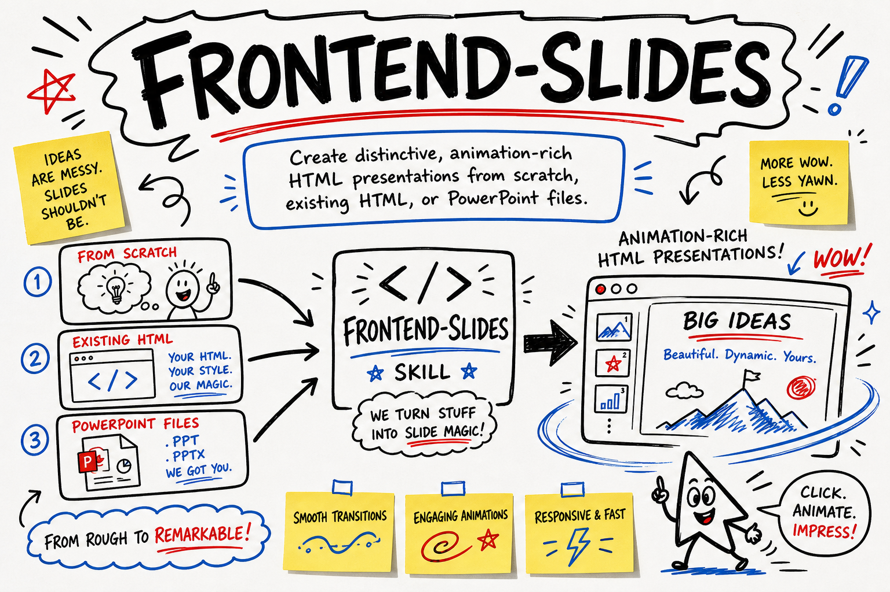

# claude-skill-frontend-slides-plus



   

> **Built on [affaan-m/ECC](https://github.com/affaan-m/ECC)** by @affaan-m (238,009 stars, MIT). All credit for the original idea to them. This fork improves and repackages it; upstream license preserved in [UPSTREAM_LICENSE](UPSTREAM_LICENSE).

**Create distinctive, accessible, animation-rich HTML presentations with Claude Code from notes, PowerPoint files, or existing decks.**

## 🎯 Why

Presentation tools make it easy to produce slides that look generic.

Converting PowerPoint to responsive HTML introduces layout, navigation, and accessibility problems.

Abstract style questions rarely help people choose a visual direction.

This skill is for speakers, educators, designers, founders, and teams who want polished browser-based decks without adding a frontend toolchain. It plugs into your existing Claude Code workflow and produces a self-contained HTML file by default.

## ⚡ Install

```bash
mkdir -p ~/.claude/skills/frontend-slides-plus && curl -fsSL https://raw.githubusercontent.com/OWNER/claude-skill-frontend-slides-plus/main/skill/SKILL.md -o ~/.claude/skills/frontend-slides-plus/SKILL.md
```

Replace `OWNER` with the GitHub account that hosts this repository.

## 🧭 Usage

Open Claude Code in a project and describe the presentation you need:

```text
Create a 10-slide HTML workshop for new engineering managers.

Audience: first-time managers at a remote software company.
Tone: focused, practical, and credible.
Include keyboard, wheel, and touch navigation.
Use placeholders wherever my notes do not contain a fact.
```

Expected output:

```text
presentation.html
```

The deck should run locally in a modern browser. It uses semantic slides, viewport-safe layouts, responsive typography, reveal animations, reduced-motion support, navigation controls, and a readable no-JavaScript fallback.

The skill follows seven core rules:

1. Produce zero-dependency HTML by default.
2. Keep every slide inside one viewport.
3. Explore visual styles with concrete previews.
4. Avoid generic template aesthetics.
5. Preserve accessibility, responsiveness, and performance.
6. Never fabricate missing content.
7. Provide fallbacks for remote assets.

## 🔧 What we changed vs upstream

- Expanded scope to include existing HTML decks, lessons, accessibility/responsiveness improvements, and an explicit exclusion for PDF-only output.
- Strengthened attribution requirements by requiring zarazhangrui’s credit to remain in derived documentation.
- Added content-fidelity and offline-resilience rules, including placeholders instead of fabricated facts and fallbacks for remote assets.
- Expanded discovery to cover audience, accessibility needs, delivery context, speaker notes, and clearer behavior when context is already sufficient.
- Tightened workflow guidance around choosing one primary mode, preserving originals, resolving conflicting instructions, and making style previews genuinely distinct.

## 📄 License

Released under the [MIT License](LICENSE). The upstream MIT license and attribution are preserved in [UPSTREAM_LICENSE](UPSTREAM_LICENSE).